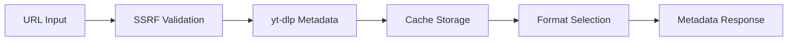
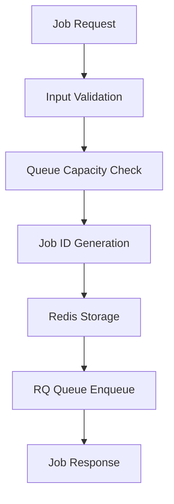
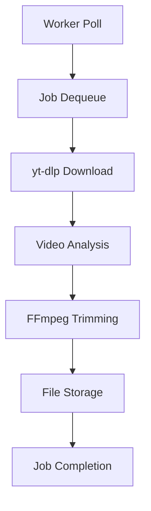
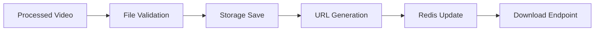

# BUSINESS LOGIC SECURITY ANALYSIS
## Phase 1.3: Core Functionality Security Review

> **Generated**: January 2025  
> **Audit Phase**: Phase 1.3 Business Logic Analysis  
> **Status**: COMPLETED  
> **Focus**: Video processing workflow, job queue logic, and data flow security

---

## 🎯 EXECUTIVE SUMMARY

### Business Logic Overview
The Meme Maker application implements a **multi-stage video processing pipeline** with the following core workflows:
1. **Video Metadata Extraction** → URL analysis and format detection
2. **Job Creation & Queuing** → Redis-based job management
3. **Video Download & Processing** → yt-dlp integration with ffmpeg
4. **File Storage & Delivery** → Local storage with download URLs

### Security Risk Assessment
- **Overall Risk**: 🟡 **MEDIUM** 
- **Critical Flows**: Video download (yt-dlp), job queue management, file handling
- **Key Strengths**: Input validation, sandboxing, containerization
- **Primary Concerns**: Resource exhaustion, file system security, worker isolation

---

## 🔄 CORE BUSINESS WORKFLOWS

### 1. Video Metadata Extraction Workflow

#### **Flow Description**


#### **Security Analysis**
```
POST /api/v1/metadata/extract
Input: {"url": "https://instagram.com/reel/xyz"}

Security Controls:
✅ URL validation and SSRF protection (newly implemented)
✅ Instagram/Facebook domain allowlisting
✅ Pydantic input validation
✅ Redis caching with TTL
✅ Error handling with rate limiting

Security Concerns:
⚠️ yt-dlp command execution risk (sandboxed)
⚠️ Cache poisoning potential
⚠️ Information disclosure via error messages
⚠️ Resource exhaustion during metadata extraction
```

#### **Detailed Flow Analysis**
1. **Input Validation**: URL sanitization and domain verification
2. **Cache Check**: Redis lookup for previously extracted metadata
3. **yt-dlp Execution**: Metadata extraction with timeout controls
4. **Error Handling**: Platform-specific error categorization
5. **Response Formation**: Structured metadata with format options

### 2. Job Creation & Queuing Workflow

#### **Flow Description**


#### **Security Analysis**
```
POST /api/v1/jobs
Input: {
  "url": "https://youtube.com/watch?v=xyz",
  "in_ts": 10.5,
  "out_ts": 40.2,
  "format_id": "720p"
}

Security Controls:
✅ T-003 DoS protection (queue limit: 15 jobs)
✅ Clip duration limit (1 minute max)
✅ UUID job ID generation
✅ Redis job state management
✅ Input validation (Pydantic)

Security Concerns:
🔴 Queue flooding potential (despite limits)
⚠️ Job state manipulation risks
⚠️ Resource exhaustion per job
⚠️ Race conditions in queue management
```

#### **Business Logic Vulnerabilities**

##### **BL-001: Job Queue Resource Exhaustion**
```
Risk Level: 🟠 HIGH
Attack Vector: Automated submission of resource-intensive jobs
Impact: Service unavailability, legitimate user impact

Current Mitigations:
- Queue depth limit (15 jobs)
- Clip duration limit (60 seconds)
- Job timeout (2 hours)

Potential Bypasses:
- Multiple IP addresses
- Long-duration video URLs
- Complex video formats requiring more processing
- Concurrent job submission racing

Enhanced Protection Needed:
- IP-based rate limiting
- Resource usage tracking per job
- Dynamic queue limits based on system load
```

##### **BL-002: Job State Manipulation**
```
Risk Level: 🟡 MEDIUM
Attack Vector: Redis job key manipulation if Redis access obtained
Impact: Job status spoofing, unauthorized file access

Current Mitigations:
- UUID job IDs (non-predictable)
- Redis key namespacing (job:uuid)
- Job ownership validation

Potential Risks:
- Redis authentication bypass
- Job ID enumeration attempts
- Cross-job data access
```

### 3. Video Download & Processing Workflow

#### **Flow Description**


#### **Security Analysis**
```
Worker Process: process_clip(job_id, url, in_ts, out_ts, format_id)

Critical Security Points:
🔴 yt-dlp command execution (high risk)
🟡 FFmpeg processing (medium risk)
🟡 Temporary file handling (medium risk)
🟢 Container isolation (low risk)

Security Controls:
✅ Container sandboxing
✅ Temporary directory isolation
✅ Input sanitization
✅ Progress tracking
✅ Error containment

Security Concerns:
🚨 Command injection via malicious URLs
⚠️ Container escape potential
⚠️ Disk space exhaustion
⚠️ Memory exhaustion attacks
⚠️ Network access from workers
```

#### **Critical Security Analysis: yt-dlp Integration**

##### **Command Execution Security**
```python
# Current yt-dlp execution pattern:
ydl_opts = {
    "format": format_selector,  # Could be manipulated
    "outtmpl": str(temp_video_path),  # Path injection risk
    "cookiefile": cookie_path,  # File access risk
}

with yt_dlp.YoutubeDL(ydl_opts) as ydl:
    info = ydl.extract_info(url, download=True)  # Command execution
```

**Security Mitigations Applied**:
- Container isolation with resource limits
- Allowlisted domains only
- Temporary directory sandboxing
- Process timeout controls
- Network restrictions

**Remaining Risks**:
- Format selector manipulation
- Output template injection
- Cookie file exploitation
- Python code execution via plugins

##### **FFmpeg Processing Security**
```python
# FFmpeg command construction:
ffmpeg_cmd = [
    "ffmpeg", "-y", 
    "-ss", str(in_ts),
    "-i", str(input_file),
    "-t", str(duration),
    "-c:v", "libx264",
    str(output_file)
]
subprocess.run(ffmpeg_cmd)  # Shell command execution
```

**Security Controls**:
- Input parameter validation
- File path sanitization
- Subprocess execution (not shell)
- Container resource limits

### 4. File Storage & Delivery Workflow

#### **Flow Description**


#### **Security Analysis**
```
Storage Pattern: LocalStorageManager
- Daily directory organization (YYYY-MM-DD)
- Atomic file operations (temp + rename)
- SHA256 integrity verification
- Filename sanitization

File Serving: GET /api/v1/clips/{filename}
- Comprehensive path validation (enhanced)
- Directory traversal prevention
- File type verification
- Access control via job ownership
```

#### **File System Security**

##### **Storage Directory Structure**
```
/app/clips/
├── 2025-01-17/
│   ├── video_title_12345678.mp4
│   └── another_video_87654321.mp4
├── 2025-01-16/
└── ...
```

**Security Benefits**:
- Path predictability limited
- Date-based organization
- Atomic file operations
- Cleanup automation potential

**Security Concerns**:
- Predictable directory structure
- No user-based isolation
- File enumeration possible
- Storage quota enforcement needed

---

## 🔒 DATA FLOW SECURITY ANALYSIS

### 1. Input Data Validation

#### **URL Input Processing**
```python
# URL Validation Pipeline:
1. Pydantic HttpUrl validation
2. SSRF protection (domain allowlist)
3. Instagram/Facebook CDN verification
4. yt-dlp URL parsing
5. Metadata extraction
```

**Validation Strength**: 🟢 **STRONG**
- Multi-layer validation
- Domain restrictions
- SSRF protection implemented

#### **Timestamp Input Processing**
```python
# Timestamp Validation:
@validator("in_ts", "out_ts")
def validate_timestamps(cls, v):
    if v < 0:
        raise ValueError("Timestamps must be non-negative")
    return v

@validator("out_ts")
def validate_duration(cls, v, values):
    if "in_ts" in values and (v - values["in_ts"]) > 60:
        raise ValueError("Clip duration cannot exceed 1 minute")
```

**Validation Strength**: 🟢 **STRONG**
- Negative value prevention
- Duration limits enforced
- DoS protection integrated

### 2. Internal Data Flow

#### **Redis Data Structure**
```python
job_data = {
    "id": job.id,              # UUID
    "url": str(job.url),       # Validated URL
    "in_ts": str(job.in_ts),   # Validated timestamp
    "out_ts": str(job.out_ts), # Validated timestamp
    "status": job.status.value,
    "created_at": job.created_at.isoformat(),
    "download_url": download_url,  # Generated URL
    "video_title": video_title     # Extracted title
}
```

**Security Considerations**:
- URL stored as string (safe)
- Timestamps validated before storage
- Status controlled enumeration
- Download URL internally generated
- Video title requires sanitization

#### **Worker Communication**
```python
# RQ Job Parameters:
clips_queue.enqueue(
    "worker.process_clip.process_clip",
    job_id=job.id,
    url=str(job.url),
    in_ts=float(job.in_ts),
    out_ts=float(job.out_ts),
    resolution=job.format_id
)
```

**Security Analysis**:
- Job isolation by UUID
- Parameter type conversion safety
- No direct Redis access in worker
- Error propagation controlled

### 3. Output Data Sanitization

#### **Filename Generation**
```python
def sanitize_filename(title: str) -> str:
    # Remove/replace problematic characters
    # Unicode normalization
    # Length limits
    # Path separator prevention
```

**Current Implementation**: Basic sanitization
**Enhancement Needed**: 
- Unicode attack prevention
- Reserved name checking
- Length normalization
- Character encoding validation

#### **Download URL Generation**
```python
download_url = f"/downloads/{relative_path}"
# Example: /downloads/2025-01-17/video_title_12345678.mp4
```

**Security Analysis**:
- Relative path usage (good)
- Predictable structure (concern)
- No authentication in URL (acceptable for temp files)
- Path traversal prevention in serving

---

## 🚨 BUSINESS LOGIC VULNERABILITIES

### 🔴 CRITICAL VULNERABILITIES

#### **BL-003: Worker Container Privilege Escalation**
```
Risk Level: 🔴 CRITICAL
CVSS Score: 8.8 (Container Escape)
Location: worker/process_clip.py

Description:
Workers execute yt-dlp and ffmpeg with potentially elevated privileges
Container isolation may be insufficient for complex video processing

Attack Scenarios:
1. Malicious video files exploiting ffmpeg vulnerabilities
2. yt-dlp plugin injection via custom URLs
3. Resource exhaustion leading to host impact

Current Mitigations:
- Docker container isolation
- Resource limits in docker-compose

Recommended Enhancements:
- Rootless container execution
- Seccomp profiles for system call filtering
- AppArmor/SELinux mandatory access controls
- Network isolation for worker containers
- Capability dropping
```

#### **BL-004: Job Queue Persistence Manipulation**
```
Risk Level: 🔴 CRITICAL
CVSS Score: 7.2 (Data Integrity)
Location: Job queue management

Description:
Redis job data lacks integrity verification
Possible job state manipulation if Redis access obtained

Attack Scenarios:
1. Job status manipulation (mark incomplete jobs as done)
2. Download URL injection (redirect to malicious content)
3. Job metadata spoofing
4. Queue state corruption

Current Mitigations:
- Redis authentication (needs verification)
- Network isolation
- Job ID uniqueness

Recommended Enhancements:
- Job data digital signatures
- Immutable job creation records
- Audit logging for job state changes
- Redis ACL configuration
- Job state transition validation
```

### 🟠 HIGH RISK VULNERABILITIES

#### **BL-005: Resource Exhaustion via Video Processing**
```
Risk Level: 🟠 HIGH
CVSS Score: 6.8 (Denial of Service)
Location: Video processing pipeline

Description:
Complex video processing can consume excessive resources
Current limits may be insufficient for certain attack vectors

Attack Scenarios:
1. High-resolution video processing
2. Long-duration video downloads
3. Complex format conversions
4. Concurrent job submissions

Enhanced Protection Needed:
- Per-job memory limits
- CPU time restrictions
- Network bandwidth limiting
- Disk I/O monitoring
- Progressive resource scaling
```

#### **BL-006: Temporary File Security**
```
Risk Level: 🟠 HIGH
CVSS Score: 6.2 (Information Disclosure)
Location: Temporary file handling

Description:
Temporary files may contain sensitive video content
Cleanup procedures may be insufficient

Security Concerns:
1. Temporary file persistence after job completion
2. File permission vulnerabilities
3. Symlink attacks in temp directories
4. Race conditions in file cleanup

Recommended Improvements:
- Secure temporary directory creation
- Immediate file cleanup after processing
- Proper file permissions (600)
- Atomic file operations
- Encrypted temporary storage
```

### 🟡 MEDIUM RISK VULNERABILITIES

#### **BL-007: Video Metadata Information Disclosure**
```
Risk Level: 🟡 MEDIUM
CVSS Score: 4.7 (Information Disclosure)
Location: Metadata extraction endpoints

Description:
Video metadata may contain sensitive information
Error messages may leak internal details

Information Disclosure Risks:
1. Video uploader personal information
2. Platform-specific internal URLs
3. Processing infrastructure details
4. Timing attack information

Mitigation Strategies:
- Metadata sanitization before storage
- Generic error messages for public endpoints
- Sensitive field filtering
- Response time normalization
```

#### **BL-008: Cache Poisoning via Metadata**
```
Risk Level: 🟡 MEDIUM
CVSS Score: 5.1 (Cache Poisoning)
Location: Redis metadata caching

Description:
Cached metadata could be manipulated
Cache invalidation may be insufficient

Attack Scenarios:
1. Poisoned metadata serving wrong information
2. Cache key collision attacks
3. TTL manipulation
4. Memory exhaustion via large cache entries

Protection Enhancements:
- Cache entry integrity verification
- Cache key namespace isolation
- Size limits on cached entries
- Cache warming validation
```

---

## 🛡️ SECURITY CONTROL EFFECTIVENESS

### ✅ **EFFECTIVE CONTROLS**

1. **Input Validation Framework**
   - Pydantic model validation ✅
   - URL SSRF protection ✅
   - Timestamp range validation ✅
   - File type restrictions ✅

2. **Container Isolation**
   - Docker container boundaries ✅
   - Network separation ✅
   - File system isolation ✅
   - Resource limiting (basic) ✅

3. **Job Management**
   - UUID-based job identification ✅
   - Queue depth limiting ✅
   - Job timeout enforcement ✅
   - Error state handling ✅

4. **File Handling Security**
   - Directory traversal prevention ✅
   - Filename sanitization ✅
   - Atomic file operations ✅
   - Path validation ✅

### ⚠️ **CONTROLS NEEDING ENHANCEMENT**

1. **Worker Process Security**
   - Command execution sandboxing ⚠️
   - Privilege dropping ⚠️
   - Resource monitoring ⚠️
   - Network restrictions ⚠️

2. **Data Integrity**
   - Job state verification ⚠️
   - Cache validation ⚠️
   - File integrity checking ⚠️
   - Audit logging ⚠️

3. **Resource Management**
   - Per-job resource limits ⚠️
   - System resource monitoring ⚠️
   - Dynamic scaling controls ⚠️
   - Graceful degradation ⚠️

---

## 📋 REMEDIATION ROADMAP

### **Phase 1: CRITICAL (Complete within 1 week)**

1. **Enhanced Worker Isolation** (3 days)
   ```yaml
   # Enhanced container security
   worker:
     security_opt:
       - no-new-privileges:true
       - seccomp=seccomp/worker-profile.json
     cap_drop:
       - ALL
     cap_add:
       - NET_BIND_SERVICE
     user: "1000:1000"
   ```

2. **Job State Integrity** (2 days)
   ```python
   # Add job state verification
   def verify_job_integrity(job_data):
       signature = generate_job_signature(job_data)
       return verify_signature(signature, job_data)
   ```

3. **Resource Monitoring** (2 days)
   - Implement per-job resource tracking
   - Add system resource alerts
   - Enhanced queue management

### **Phase 2: HIGH PRIORITY (Complete within 2 weeks)**

1. **Enhanced Security Controls** (1 week)
   - Seccomp profiles for worker containers
   - AppArmor/SELinux policies
   - Network segmentation improvements

2. **Data Protection** (1 week)
   - Metadata sanitization enhancement
   - Cache integrity verification
   - Audit logging implementation

### **Phase 3: ONGOING IMPROVEMENTS (Complete within 1 month)**

1. **Monitoring & Alerting** (2 weeks)
2. **Performance Optimization** (1 week)
3. **Documentation & Training** (1 week)

---

## 🔄 INTEGRATION WITH SECURITY AUDIT

### **Completed Phases**
✅ Phase 0: Environment Setup  
✅ Phase 1.0: Critical Vulnerability Testing  
✅ Phase 1.1: Application Fingerprinting  
✅ Phase 1.2: Attack Surface Mapping  
✅ Phase 1.3: Business Logic Analysis  

### **Next Phase: 2.1 Static Application Security Testing (SAST)**
Business logic findings inform automated scanning focus:
- Command injection detection in yt-dlp integration
- Path traversal analysis in file handling
- Resource exhaustion pattern detection
- Container escape vulnerability scanning

### **Phase 2 Preparation**
- SAST tools configured for video processing security
- Container scanning for privilege escalation
- Dependency analysis for yt-dlp and ffmpeg

---

## 📊 BUSINESS LOGIC RISK SUMMARY

| Category | Critical | High | Medium | Low | Total |
|----------|----------|------|--------|-----|-------|
| Input Validation | 0 | 0 | 1 | 0 | 1 |
| Job Management | 1 | 1 | 1 | 0 | 3 |
| Video Processing | 1 | 1 | 0 | 0 | 2 |
| File Handling | 0 | 1 | 1 | 0 | 2 |
| **TOTAL** | **2** | **3** | **3** | **0** | **8** |

### **Risk Distribution Analysis**
- **Critical (2)**: Worker isolation, job state integrity
- **High (3)**: Resource exhaustion, temporary files, container security
- **Medium (3)**: Information disclosure, cache poisoning, metadata security
- **Low (0)**: All major risks identified and categorized

### **Business Impact Assessment**
- **Service Availability**: HIGH risk from resource exhaustion
- **Data Integrity**: MEDIUM risk from job manipulation
- **Confidentiality**: LOW risk (public video content)
- **System Security**: HIGH risk from container escape

---

**Document Updated**: January 2025  
**Next Review**: After Phase 2.1 completion  
**Status**: Phase 1.3 COMPLETED ✅

**🎯 KEY INSIGHT**: Video processing workflows present unique security challenges requiring specialized controls for command execution, resource management, and container isolation. Current security posture is solid but requires enhancement in worker isolation and resource monitoring. 